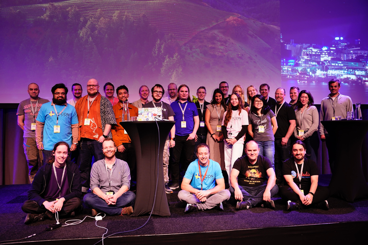
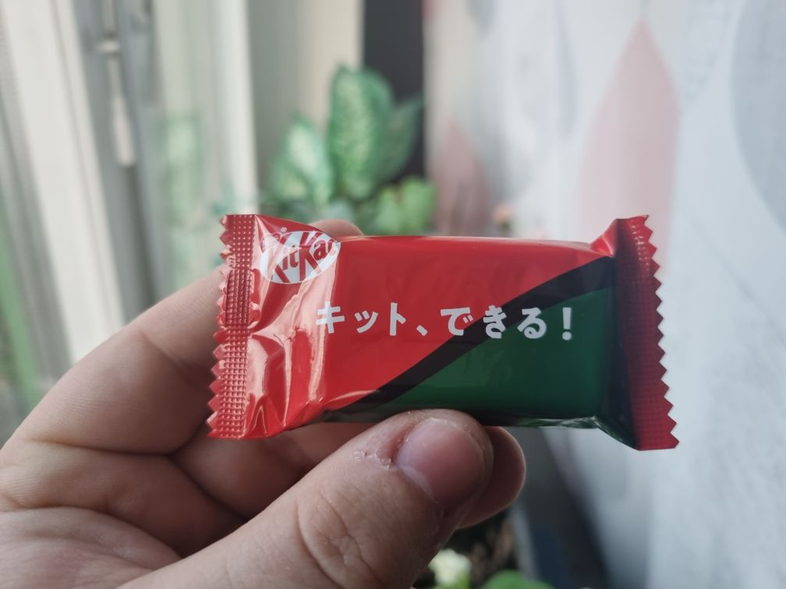

## Prologue

Those who know me, know that I have a very strange obsession with timezone related topics, in fact - when it comes to this, I am quite opinionated.

I have created a passion talk about this - but what does that matter, if there is no one to listen to it?

That one day changed, as I did get an email from _PyCon Sweden_ that they have opened up for _Call for Proposals (CFP)_, and that I had one week to send in my proposal.

I sent it in, and to my amazement - later I got the response that my talk got accepted!

Apparently it was one of the 17 accepted talks, and they have had maybe 80 proposals in total...?

## PyCon Sweden 2024 🐍🇸🇪

> The convention was really nice. Many good talks, nice people to talk to, great fika and food. All around I would say a really good convention!

> Official photograph of speakers for the convention, taken during Day 1.

### The day before PyCon Sweden 2024

The day before I did get to do some final, yet important preparations.  
I wanted to prepare myself both mentally and physically - thus I went to the barber to shave off some of my beard in order to make me look as respectable as possible. I also painted my glasses, as some of the colour had fallen off, thus bought and applied black nail-polish in order to not have a metallic surface that would easily reflect light right between my eyes.

I did also get a letter from my Japanese Penpal that made me very happy, she had also attached some gifts, where as some of them were some matcha flavoured KitKat's.  
KitKat's are popular in Japan, especially as they accidentally cognate "Kitto Katsu (きっと勝つ)", which would be "You will surely win", and thus can be used as good luck charms.

Later towards the evening I went to where the convention was to be held, at Clarion Hotel Stockholm (Skanstull). Here I met some other somewhat nervous speakers, and we did get to test out that the HDMI seemed to works for presenting, as well as feel the size and scope of the room.

After, I got invited for a beer at a close-by pub, to talk with some of board and volunteers that make PyCon happen. We had some good talks, and not before long we parted ways as many of them had naturally go to bed early, as they would start working at 07:00 the next day at the Hotel.

### The first day

The first day, was surely the most important day for me. As this day, I would hold a talk myself at 16:30, on the main stage.  
Before leaving home, I grabbed myself a good-luck KitKat:

> [kitto, dekiru!]
> For sure, you can do it! / I know, I can do it!

If I don't believe in myself, I can at least believe in this tiny chocolate confectionary that believes in me. And simply, that's all I need - since I have prepared for this day and this talk a lot already.

From here on, the day kicked off! There was some good talk during the day.
[Cristián Maureira-Fredes started the conference with his talk](https://pretalx.com/pyconse-2024/talk/CCPCRS/), he is member of the Python Software Foundation board, and his talk was funny, and was about that Python, is a lot about community and not only "just a language".

Then there was a talk by a [Christian Heitzmann about documentation](https://pretalx.com/pyconse-2024/talk/X7DH3L/), and that Atlasian Wikis are where documentation goes to die - and propose that he believes that projects should document more in `AsciiDoc`, rather than `Markdown` which otherwise mostly is "the standard" for some light close-to-code documentation.

[Tobias Modig had a great talk](https://pretalx.com/pyconse-2024/talk/NVZQSS/) about that age is just a number, and that sometimes just because some youth are clearly quicker than what you are, doesn't mean that that's the main goal - but quality is - which often can be achieved by having more senior people stay in coding. And yuck, the horrors of the [Peter Principle](https://en.wikipedia.org/wiki/Peter_principle) sometimes feels scarily too close to home!!

Those were the talks of the day that really spoke to me, except you know, I am biased here and of course my own is the apex of the whole day... 😅

#### It's About Time

My talk, I call ["It's About Time"](https://pretalx.com/pyconse-2024/talk/QHFSDN/) - as both the talk is literary about time, and I think it is figuratively about time for my talk.

The prior talk ended a bit early, so there was some dead time - just like the audience was somewhat tired too. I had an idea earlier, which I executed, which was that I wanted to do a "call-and-response". As it was the first time for real on a big stage like this, I wanted to try it out.

> Ok, everybody. I want to try this thing... (I don't remember verbatim)
> When I say "It's about", I want you to shout "TIME".
> Ready?
> > It's About...
> > **Time!**

And my presentation was off, changing to the first slide which simply has the title - "It's About Time".

From here on, my presentation went pretty great!  
I think that I did wake up the audience a bit with the shouting, and could keep their attention to some degree.  
At the end of my talk, there was a somewhat unusually long question round, with many people asking questions - this must mean that they were engaged, right?  
Afterwards there were also people seeking me out to ask some questions in private - and from this, I can only say that my talk must have been a real success - even some people calling it the best talk of the whole day!! 🥹

### The second day 

The second day, was a great day. Not only was my talk already over, thus leaving me some slack, but it did also have some great talks, talking to people who know me from my talk, and in the evening a fun after party!

Some of the great talks of this day were:
- Phil Ewels, about his nice tool [rich-click](https://github.com/ewels/rich-click) that combines [rich](https://github.com/Textualize/rich) and [click](https://github.com/pallets/click/) - to make awesome help text for CLI programs!
- [Marc-André Lemburg had a talk about the `match` statement](https://pretalx.com/pyconse-2024/talk/JPZ7WK/), which I think is very well made for people to learn about it and how it can be quite useful.
- And of course [Jesper Larsson, had a great talk opening peoples eyes to system security issues](https://pretalx.com/pyconse-2024/talk/Q9MRZC/), as a penetration tester - he knows a lot about how to learn about other peoples systems - and how to break them.
- The Lightning Talks at the end, had many fun, short presentations which is always great. Me having one two years ago actually gave me bonus points in order to win a presenter slot at the conference.

Of course, there was many other great talks, but these things came to my mind for the second day!

#### The After-Con 🍻
